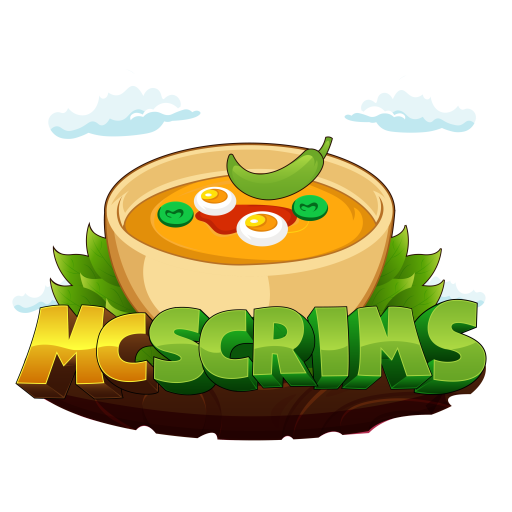

 

  

  <h3 align="center">McScrims Staff Client</h3>

  

    Internal staff control client for the McScrims Minecraft Network. This is a secure desktop application built with Electron, React, and TypeScript for monitoring and managing the Minecraft network infrastructure.
     
    <a href="https://github.com/McScrims-Network/McScrims-Staff-Client/issues">Report Bug</a>
    ·
    <a href="https://github.com/McScrims-Network/McScrims-Staff-Client/issues">Request Feature</a>
  

  
Table of Contents

  <ol>
    <li>
      <a href="#about-the-project">About The Project</a>
      <ul>
        <li><a href="#features">Features</a></li>
        <li><a href="#built-with">Built With</a></li>
      </ul>
    </li>
    <li>
      <a href="#getting-started">Getting Started</a>
      <ul>
        <li><a href="#prerequisites">Prerequisites</a></li>
        <li><a href="#installation">Installation</a></li>
      </ul>
    </li>
    <li><a href="#usage">Usage</a></li>
    <li><a href="#roadmap">Roadmap</a></li>
    <li><a href="#contributing">Contributing</a></li>
    <li><a href="#license">License</a></li>
    <li><a href="#contact">Contact</a></li>
    <li><a href="#acknowledgments">Acknowledgments</a></li>
  </ol>

## About The Project

The McScrims Staff Client is a specialized tool designed to streamline the workflow of our moderation and administration team. It connects directly to our Pterodactyl backend and provides a unified interface for server management, communication, and monitoring.

(<a href="#readme-top">back to top</a>)

### Features

- **🔐 Secure Authentication** - Staff login with role-based access control and persistent sessions.
- **⚡ Real-time Monitoring** - Live tracking of TPS, MSPT, CPU, and RAM usage via WebSocket.
- **📊 Advanced Analytics** - Interactive charts for server performance and player trends over time.
- **👥 Player Manager** - Global search (UUID/Name), detailed profiles, and silent moderation tools.
- **📅 Task Scheduler** - Automated cron-based tasks for server restarts and maintenance.
- **🎫 Live Ticket System** - Real-time support chat with instant WebSocket updates.
- **☁️ Cloud Sync** - User settings and preferences synchronized across devices.
- **📂 File Manager** - Integrated file browser with Monaco Editor for config editing.
- **💻 Live Console** - Interactive terminal for logs and commands.

(<a href="#readme-top">back to top</a>)

### Built With

* [![Electron][Electron.js]][Electron-url]
* [![React][React.js]][React-url]
* [![TypeScript][TypeScript.org]][TypeScript-url]
* [![Vite][Vite.dev]][Vite-url]
* [![TailwindCSS][TailwindCSS.com]][Tailwind-url]
* [![Zustand][Zustand.pm]][Zustand-url]
* [![Monaco][Monaco.editor]][Monaco-url]
* [![Shadcn][Shadcn.ui]][Shadcn-url]

(<a href="#readme-top">back to top</a>)

## Getting Started

Since this application is internal software, the source code is closed. Staff members can download the latest pre-compiled version directly from GitHub.

### Prerequisites

* **Windows 10 or Windows 11** (64-bit)
* **McScrims Staff Account** (Credentials provided by Admin)

### Installation

1. Navigate to the **[Releases Page](https://github.com/McScrims-Network/McScrims-Staff-Client/releases)**.
2. Download the latest installer (e.g., `McScrims-Staff-Client-Setup-1.3.0.exe`).
3. Run the installer.
   * *Note: If Windows SmartScreen appears, click "More Info" -> "Run Anyway" (as this is an internal tool).*
4. Once installed, the application will launch automatically.
5. Log in using your provided staff credentials.

**Auto-Update:** The client will automatically check for updates on startup and notify you when a new version is available.

(<a href="#readme-top">back to top</a>)

## Usage

After launching the client, log in using your McScrims Staff credentials.

* **Command Palette:** Press **`Ctrl + K`** anywhere to open the global search.
* **Console:** The terminal supports standard Pterodactyl commands.
* **Chat:** Click the floating button (bottom right) to open the global staff chat.
* **File Editor:** Double-click files to open them. Press `Ctrl + S` to save changes directly to the remote server.

(<a href="#readme-top">back to top</a>)

## Roadmap

We are constantly working to improve the McScrims Staff Client.

### 📅 Next Feature Update (v1.7.0)

#### 🖥️ Server & Monitoring
- [x] **Resource History Graphs** - CPU, RAM, and TPS charts over time per server.
- [x] **Auto-Restart on Crash** - Automatically restart servers when they crash or become unresponsive.
- [x] **Server Comparison View** - Side-by-side comparison of metrics across multiple servers.
- [x] **Resource Alerts** - Notifications for low disk space, memory exhaustion, or prolonged high CPU.

#### ⚡ Produktivität & UX
- [x] **Customizable Dashboard** - Drag-and-drop widgets, personalized layout per staff member.
- [x] **Notification Center** - Centralized inbox for all alerts with read/unread status.
- [x] **Quick Actions Bar** - One-click shortcuts for your most-used actions.
- [x] **Multi-Tab Server View** - Open multiple server details in tabs for parallel monitoring.

#### 👥 Spieler-Management
- [ ] **Player Notes (Rich Text)** - Formatted notes with links, formatting, and attachments.
- [ ] **Player Alias Tracking** - Track name changes and account associations.
- [ ] **Mass Appeal Actions** - Approve, reject, or assign multiple ban appeals at once.
- [ ] **Cross-Server Player Search** - Find a player across all servers in one search.

#### 🔐 Sicherheit & Compliance
- [x] **Passkey / WebAuthn Login** - Passwordless login with hardware keys or biometrics.
- [x] **Session Device Management** - View and revoke active sessions per device.
- [x] **Audit Log Retention Policies** - Configurable retention and archival rules.
- [x] **Role Permission Presets** - Predefined permission templates for common staff roles.

#### 📊 Reporting & Export
- [ ] **Report Templates** - Save and reuse custom report configurations.
- [ ] **Real-Time Analytics Dashboard** - Live charts for player counts, server health, and trends.
- [ ] **Export to External Systems** - Webhook or API integration for report delivery.
- [ ] **Comparative Uptime Reports** - Compare uptime across servers or time periods.

#### 🔌 Integration & Automation
- [x] **Webhook Integrations** - Trigger webhooks on server events (crash, player join, etc.).
- [x] **Discord/Slack Alerts** - Send critical alerts to team channels.
- [x] **Scheduled Task Templates** - Reusable task configurations for common workflows.
- [x] **API Access for External Tools** - Read-only API for dashboards and monitoring tools.

### ✅ Recently Completed (v1.6.0)
- [x] **Server & Monitoring** - Server Health Alerts, Server Groups/Tags, Bulk Actions, Maintenance Windows.
- [x] **Produktivität & UX** - Favorites/Pinned Servers, Enhanced Command Palette, Keyboard Shortcuts, Recent Activity.
- [x] **Spieler-Management** - Player Watchlist, Ban Appeal Queue, Player Activity Timeline, Whitelist Management.
- [x] **Sicherheit & Compliance** - 2FA/MFA, IP Whitelist, Enhanced Audit Export.
- [x] **Reporting & Export** - Custom Reports, Scheduled Reports, Server Uptime Dashboard.

See the [open issues](https://github.com/McScrims-Network/McScrims-Staff-Client/issues) for a full list of proposed features.

(<a href="#readme-top">back to top</a>)

## Contributing

Contributions are restricted to the core development team.
However, staff members are encouraged to report bugs or request features:

1. Go to the [Issues](https://github.com/McScrims-Network/McScrims-Staff-Client/issues) tab.
2. Click **New Issue**.
3. Select **Bug Report** or **Feature Request**.
4. Fill out the template with as much detail as possible.

(<a href="#readme-top">back to top</a>)

## License

Distributed under the Proprietary License. This software is intended for **internal use by the McScrims Network staff only**.

(<a href="#readme-top">back to top</a>)

## Contact

McScrims Network - [@McScrims](https://x.com/McScrimsNetwork) - administration@mcscrims.club

Project Link: [https://github.com/McScrims-Network/McScrims-Staff-Client](https://github.com/McScrims-Network/McScrims-Staff-Client)

(<a href="#readme-top">back to top</a>)

## Acknowledgments

* [Pterodactyl Panel](https://pterodactyl.io)
* [XTerm.js](https://xtermjs.org/)
* [Monaco Editor](https://microsoft.github.io/monaco-editor/)
* [Recharts](https://recharts.org/)
* [Lucide React](https://lucide.dev/)
* [dnd-kit](https://dndkit.com/)

(<a href="#readme-top">back to top</a>)

[Electron.js]: https://img.shields.io/badge/Electron-191970?style=for-the-badge&logo=Electron&logoColor=white
[Electron-url]: https://www.electronjs.org/

[React.js]: https://img.shields.io/badge/React-20232a?style=for-the-badge&logo=react&logoColor=61DAFB
[React-url]: https://reactjs.org/

[TypeScript.org]: https://img.shields.io/badge/TypeScript-007ACC?style=for-the-badge&logo=typescript&logoColor=white
[TypeScript-url]: https://www.typescriptlang.org/

[Vite.dev]: https://img.shields.io/badge/Vite-646CFF?style=for-the-badge&logo=vite&logoColor=white
[Vite-url]: https://vitejs.dev/

[TailwindCSS.com]: https://img.shields.io/badge/Tailwind_CSS-38B2AC?style=for-the-badge&logo=tailwind-css&logoColor=white
[Tailwind-url]: https://tailwindcss.com/

[Zustand.pm]: https://img.shields.io/badge/Zustand-443E38?style=for-the-badge&logo=react&logoColor=white
[Zustand-url]: https://github.com/pmndrs/zustand

[Monaco.editor]: https://img.shields.io/badge/Monaco_Editor-1E1E1E?style=for-the-badge&logo=visual-studio-code&logoColor=white
[Monaco-url]: https://microsoft.github.io/monaco-editor/

[Shadcn.ui]: https://img.shields.io/badge/shadcn%2Fui-000000?style=for-the-badge&logo=shadcnui&logoColor=white
[Shadcn-url]: https://ui.shadcn.com/
